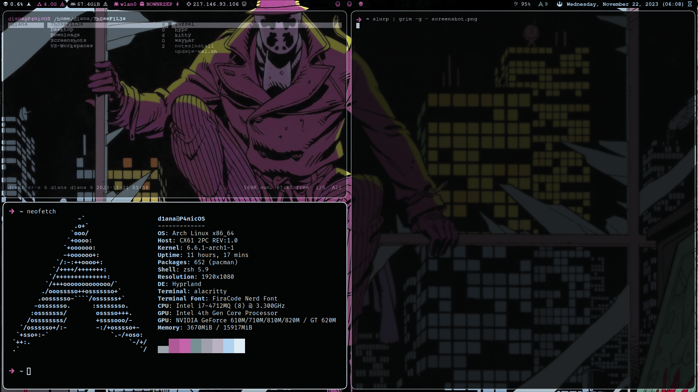

## Synopsis:
Simple installation script for Arch Linux with `wayland`, `hyperland` and `waybar` riced with `py-wal`.
It also unlocks the Black Arch library and downloads some basic security utils.
Have in mind that `hyperland` wont work on virtual machines, so this will only work on bare metal. 

- Planning to add the next features soon:
  - Thinkpad experience 


## Details:

| Category               | Software               
|------------------------|------------------------|
| Window Manager         | Hyprland               |
| Terminal Manager       | Alacritty, kitty       |
| File Manager           | Ranger, Nemo           |
| Status Bar             | Waybar                 |
| Launcher               | Rofi                   |
| Shell                  | Zsh                    |
| Browser                | Librewolf              |
| Text Editor            | neovim, Visual Code    |

### Additional Packages included:

`ufw` , `wireshark` , `bleachbit` , `virtualbox` , `burp` , `obsidian` , `nordvpn` , `signal`, `btop` , `wget` , `curl` , `locate` , `qflipper` ,  

### Zsh Plugings, Aliases and Functions:

### Custom Scripts:

## Installation:

Make you sure you have a `USB` ready to use with a verified Arch `ISO`, you can find how to verified the integrity of your `ISO` inside the Arch documentation.
- You can use `rufus` or `dd` command in linux:
```bash
# Lookup for your USB drive
sudo fdisk -l
# Lookup for the path of your ISO file
realpath isofile
# Creates the bootable USB
sudo dd bs=4M if=/home/shutter/Documents/ISOs/archlinux-2023.10.14-x86_64.iso of=/dev/sdb
```
- Once you booted the `USB` and accessed the Arch `ISO` you may need to connect to your `wifi`:
```bash
# Start iwctl
iwctl
# list devices
device list
# Interface set to scan
station wlan0 scan
# Scan for networks
station wlan0 get-networks
# Connect to a network
station wlan0 connect networkname
```
- There are more advanced ways to install Arch but this is a very simple guide, there are just a few relevant steps that you need to follow for this build:
  - Use `ext4` file type for your system
  - `Systemd-bootloader` can give you problems with encryptation, in that case just use `GRUB`
  - Choose `Hyperland` as profile
  - Make sure dont choose any session manager as `Hyperland` recommends to login directly from the `TTY`.
  - Choose `NetworkManager`
  - I always add the extra libraries
- Wait for the install to finish, once is done reboot your system.
- Now you should need to connect to internet again, this time use `NetworkManager`:
```bash
# Check if Networkmanager is running
sudo systemctl status NetworkManager.service
sudo systemctl start NetworkManager.service
# Connect to wifi
nmcli device wifi list
nmcli device wifi connect SSID_or_BSSID password password
# Different interface
nmcli device wifi connect SSID_or_BSSID password password ifname wlan1 profile_name
# Hidden network
nmcli device wifi connect SSID_or_BSSID password password hidden yes
```
- And download this repository:

```bash
https://github.com/b0llull0s/P4n1c-Arch.git
cd ~/P4nic-Arch
chmod +x *.sh
```
You may want to add your wallpapers to the `w4llp4p3rs` folder or just change the name and path on the script as you want.
If you experience problems with `py-wal`, make sure that all the paths inside the config files match with your system files.



## Tips:

- In case you need to generate a new `py-wal` template just run:
```bash
wal -i Downloads/w4llp4p3rs/1.jpg
```
- In case you need to make zsh your default shell:
```bash
usermod --shell /usr/bin/zsh username
```
- Refresh your system data base
```bash
sudo updatedb
``` 
- To implement plugings use locate to find the path of the plugin file and add it to your source file:
```bash
# use this command:
locate zsh-autosuggestions
# Copy the .zsh entry and add it as source in the config file:
source /usr/share/zsh/plugins/zsh-autosuggestions/zsh-autosuggestions.zsh
```

## Keybindings:

| Key Combination                      | Action                  |
|--------------------------------------|-------------------------|
| `Super + Enter`                      | Alacritty               |
| `Super + F`                          | Librewolf               |
| `Super + K`                          | Kill Window            |
| `Super + D`                          | Rofi                    |
| `Super + E`                          | Nemo                    |
| `Super + [1-9]`                      | Switch Workspace        |
| `Super + [SHIFT] + [1-9]`            | Move Window to Workspace|
| `Super + [SHIFT] + [ARROW]`          | Resize Window           |
| `Super + [ARROW]`                    | Move within Windows     |
| `Super + P`                          | Toggle Split            |
| `Super + O`                          | Toggle Float            |
| `Super + I`                          | Swap Horizontal/Verical |
| `Super + U`                          | Full screen             |
| `Super + [PRINTSCRN]`                | Screenshot              |
| `Super + C`                          | VSCode                  |
| `Super + T`                          | Obsidian                |
| `Super + X`                          | code .config            |
| `Super + Z`                          | code .zshsrc            |
| `Super + S`                          | Signal                  |
| `Super + W`                          | Wireshark               |

## Credits and appreciations 


